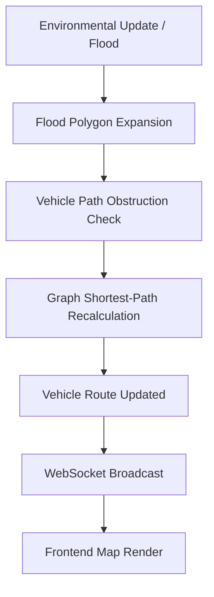

# Deluge

**Real-Time Flood Intelligence & Evacuation System**

Deluge is a real-time flood emergency decision-support platform that continuously updates evacuation routes, rescue missions, and safe zones as environmental conditions change. By minimizing cognitive load and prioritizing actionable intelligence, Deluge helps operators navigate chaos with clarity. 

---

## Problem Statement

During a flood disaster, conditions evolve rapidly and unpredictably. Traditional navigation systems fail in these scenarios because they are not built for real-time, large-scale environmental changes—they often route responders directly into rising waters. Emergency operators are frequently overwhelmed with scattered information, outdated maps, and fragmented communication tools, leading to cognitive overload and delayed critical decision-making.

---

## Stakeholder Pain Points & Business Value

Based on operational analyses from FEMA and disaster logistics teams, emergency operations fail primarily due to three factors, all of which Deluge solves:

1. **The "Last Mile" Logistics Failure**: Infrastructure fails unpredictably. Traditional routing systems aren't built for dynamic environments, resulting in responders driving into impassable hazards. **Deluge solves this** via sub-second graph recalculation—when a road floods, the system instantly reroutes all affected units.
2. **Data Overload & Lack of a Common Operating Picture (COP)**: EOC operators are bombarded with scattered information, leading to cognitive overload. **Deluge solves this** by rendering a single, real-time tactical map that aggregates flood data, mission status, and resource tracking into one view.
3. **Software Abandonment Under Pressure**: Complex software is abandoned during a crisis because responders lack the mental bandwidth to navigate dense menus. **Deluge solves this** with its "Calm Under Chaos" UI, which prioritizes actionable intelligence (e.g., "Reroute Unit A to avoid flooding") over decorative metrics.

---

## Solution Overview

Deluge is designed specifically for emergency operations centers (EOCs) working under extreme pressure. It replaces disconnected data feeds with a unified, real-time tactical map. Deluge maintains a dynamic, in-memory road network that recalculates optimal routes, safe zones, and mission priorities instantly as flood data updates. Unlike conventional routing systems, Deluge prioritizes operational decision-making, speed, and safety over feature bloat.

---

## Key Features

- **Interactive Mission Dispatch**: Operators can click directly on the GIS map to set Origin and Destination coordinates, instantly dispatching units to the field.
- **Dynamic Route Recalculation (is_point_flooded)**: Vehicles continuously monitor their path. If an upcoming road segment intersects an active flood polygon, they instantly query the routing engine for a safe detour.
- **Real-Time Flood Awareness**: Visualizes evolving flood risk, depth, and expansion directly on the operational map, accurately reflecting historical data.
- **Historical Incident Replay**: Synchronized replay of the August 2018 Kerala floods, generating accurate flood polygons and road closures that directly impact live routing.
- **Event-Driven Updates**: Pushes state changes (vehicle movement, mission status, flood events) via WebSockets, ensuring the UI remains perfectly synced without latency.
- **Comprehensive Historical Analysis**: Live statistical analysis of flooded roads, affected infrastructure, and active responders.

---

## Architecture Overview

Deluge utilizes an event-driven architecture designed for zero-latency response. The backend maintains an in-memory graph of the road network using OSM data. When a flood event is ingested, the system validates vehicle paths using geographical intersection (`is_point_flooded`), calculates detours, and broadcasts state deltas via WebSockets to the frontend.

```text
+-------------------+       +-----------------------+       +-------------------+
|                   |       |                       |       |                   |
|  Historical Data  +------>+  FastAPI Backend      +------>+  Next.js Frontend |
|  (Kerala 2018)    |       |  (WebSocket Server)   |       |  (MapLibre UI)    |
|                   |       |                       |       |                   |
+-------------------+       +-----------+-----------+       +-------------------+
                                        |
                                        v
                            +-----------+-----------+
                            |                       |
                            |  In-Memory Graph      |
                            |  (OSMnx / NetworkX)   |
                            |                       |
                            +-----------------------+
```

---

## System Workflow



---

## Compliance With Hackathon Constraints

Deluge strictly adheres to all hackathon constraints to ensure an optimized, deployable MVP:

- **Zero-Pipeline Processing**: The system maintains an in-memory road graph using `NetworkX` and `OSMnx`. 
- **Sub-Second Recalculation**: By utilizing event-driven architecture over WebSockets and spatial intersection checks, the system avoids heavy polling and re-renders.
- **No Commercial Map APIs**: Deluge relies entirely on open-source solutions, combining OpenStreetMap data, MapLibre GL for rendering, and GeoJSON for data interchange.

---

## Technology Stack

| Layer             | Technology                                | Purpose                                   |
|-------------------|-------------------------------------------|-------------------------------------------|
| **Frontend**      | Next.js, React, TypeScript                | Fast, type-safe UI framework              |
| **Backend**       | FastAPI, Python                           | High-performance, async event server      |
| **Mapping**       | MapLibre GL, OpenStreetMap, GeoJSON       | Open-source vector tile rendering         |
| **State**         | Zustand                                   | Global state and WebSocket synchronization|
| **Communication** | WebSockets                                | Real-time bi-directional streaming        |
| **Styling**       | CSS Modules, Lucide Icons                 | Consistent, accessible EOC aesthetic      |
| **Graph Engine**  | OSMnx, NetworkX, Shapely (Python)         | In-memory road network & spatial analysis |

---

## Project Structure

```text
deluge/
├── frontend/          # Next.js React application (UI, Map, State, WebSockets)
├── backend/           # FastAPI application (Routing Engine, Simulation Loop)
└── documentation/     # System architecture and implementation documentation
```

---

## Getting Started

### Prerequisites
- Node.js (v18+)
- Python (3.10+)
- npm or pnpm

### Installation

Clone the repository:
```bash
git clone https://github.com/iamnih4l/Deluge.git
cd Deluge
```

### Backend Setup
```bash
cd backend
python -m venv venv
# On Windows use `venv\Scripts\activate`, on macOS/Linux use `source venv/bin/activate`
venv\Scripts\activate
pip install -r requirements.txt
```

### Frontend Setup
```bash
cd frontend
npm install
```

### Running the Application

1. **Start the Backend:**
```bash
cd backend
uvicorn app.main:app --host 0.0.0.0 --port 8000
```

2. **Start the Frontend:**
```bash
cd frontend
npm run dev
```
The application will be available at `http://localhost:3000`.

---

## API Overview

| Method | Route                   | Description                                      |
|--------|-------------------------|--------------------------------------------------|
| WS     | `/ws`                   | Real-time WebSocket connection for state sync    |
| POST   | `dispatch_mission` (WS) | Dispatches a vehicle to clicked map coordinates  |
| POST   | `seek` (WS)             | Scrubber control for historical event timeline   |
| POST   | `set_speed` (WS)        | Modifies the simulation tick rate                |

---

## Demo Walkthrough

1. **Initial State**: The operator views a calm, dark-themed map of the operational theater in Kerala.
2. **Interactive Dispatch**: Click a unit type (e.g., Ambulance) from the Command Palette, click a map origin, and click a destination. The backend generates a precise road route.
3. **Flood Event Occurs**: Historical replay triggers a flood cell (e.g., Periyar River overflow).
4. **Dynamic Rerouting**: As the flood expands, a dispatched vehicle detects its path is compromised, queries the graph engine, and instantly reroutes around the flood polygon.
5. **Historical Analysis**: Navigate to the Analysis tab to view live stats on flooded roads, water volume, and 2018 historical references.

---

## Design Principles

- **Speed Over Complexity**: A fast, reliable system is infinitely better than a complex, slow one.
- **Reliability Over Novelty**: Predictable deterministic routing over black-box AI routing.
- **Clarity Over Feature Count**: A focused interface that answers "What should I do next?"
- **Human-Centered Emergency Operations**: Software built for operators, not consumers.

---

## Impact

Deluge significantly reduces the cognitive load on emergency operators, allowing them to make faster, more accurate decisions. By continuously adapting to environmental realities in real time, it prevents responders from being misdirected into hazardous areas, optimizes resource allocation, and ultimately saves lives.

---

## Team: LunaX

| Name | Role | GitHub | LinkedIn |
|------|------|--------|----------|
| Mohammed Nihal | Lead Architect & AI Engineer | [@iamnih4l](https://github.com/iamnih4l) | [iam-nih4l](https://www.linkedin.com/in/iam-nih4l/) |
| Mohammed Fazil Nayaz | Technical Writer | [@MohammedFazilNayaz](https://github.com/MohammedFazilNayaz) | [mohammed-fazil-nayaz](https://www.linkedin.com/in/mohammed-fazil-nayaz-6210a921a) |
| Noel Mathias | Frontend Engineer | [@noelmathias](https://github.com/noelmathias) | [noel-mathias](https://www.linkedin.com/in/noel-mathias-4b7515285) |
| Marwan TH | Content Strategist | [@Marvan-TH](https://github.com/Marvan-TH) | [muhammed-hariful-marvan-t-h](https://www.linkedin.com/in/muhammed-hariful-marvan-t-h-a7ab96a0) |

---

## License

MIT License. See [LICENSE](LICENSE) for more information.
