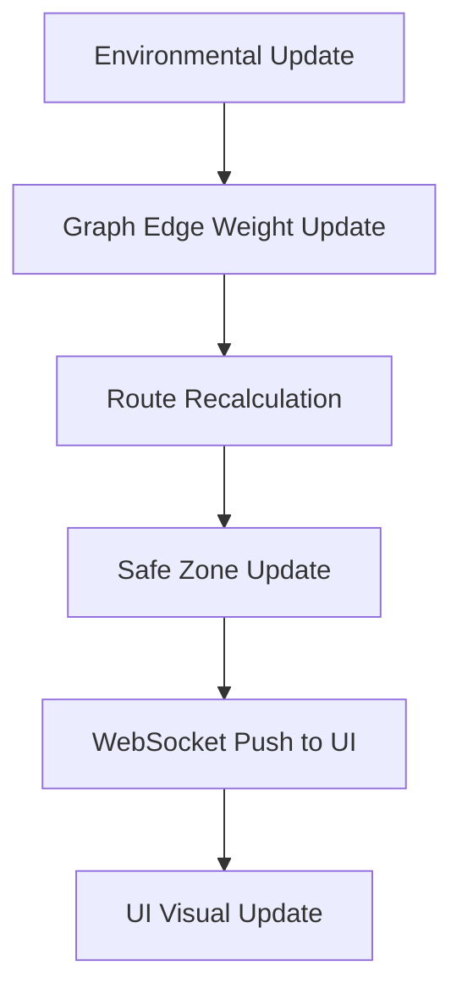

# Deluge

**Real-Time Flood Intelligence & Evacuation System**

Deluge is a real-time flood emergency decision-support platform that continuously updates evacuation routes, rescue missions, and safe zones as environmental conditions change. By minimizing cognitive load and prioritizing actionable intelligence, Deluge helps operators navigate chaos with clarity. 

---

## Problem Statement

During a flood disaster, conditions evolve rapidly and unpredictably. Traditional navigation systems fail in these scenarios because they are not built for real-time, large-scale environmental changes—they often route responders directly into rising waters. Emergency operators are frequently overwhelmed with scattered information, outdated maps, and fragmented communication tools, leading to cognitive overload and delayed critical decision-making.

---

## Solution Overview

Deluge is designed specifically for emergency operations centers (EOCs) working under extreme pressure. It replaces disconnected data feeds with a unified, real-time tactical map. Deluge maintains a dynamic, in-memory road network that recalculates optimal routes, safe zones, and mission priorities instantly as flood data updates. Unlike conventional routing systems, Deluge prioritizes operational decision-making, speed, and safety over feature bloat.

---

## Key Features

- **Dynamic Route Recalculation**: Instantly reroutes emergency vehicles around newly flooded areas in sub-second time.
- **Real-Time Flood Awareness**: Visualizes evolving flood risk and water depth directly on the operational map.
- **Safe-Zone Identification**: Dynamically evaluates and recommends shelters based on accessibility, risk, and capacity.
- **Mission Prioritization**: Tracks rescue units and intelligently assigns them based on proximity and threat level.
- **Event-Driven Updates**: Pushes delta changes via WebSockets, ensuring the UI remains perfectly synced without latency.
- **Explainable Recommendations**: Uses asynchronous AI to provide clear, actionable insights and explain rerouting decisions.
- **Timeline Replay**: Allows operators to scrub through the disaster timeline to review progression and decisions.

---

## Architecture Overview

Deluge utilizes an event-driven architecture designed for zero-latency response. The backend maintains an in-memory graph of the road network. When a flood event is ingested, the system updates specific edge weights and broadcasts these delta changes via WebSockets to the frontend, which handles rendering and routing locally or via fast API calls.

```text
+-------------------+       +-----------------------+       +-------------------+
|                   |       |                       |       |                   |
|  Event Simulator  +------>+  FastAPI Backend      +------>+  Next.js Frontend |
|  (Flood Data)     |       |  (WebSocket Server)   |       |  (MapLibre UI)    |
|                   |       |                       |       |                   |
+-------------------+       +-----------+-----------+       +-------------------+
                                        |
                                        v
                            +-----------+-----------+
                            |                       |
                            |  In-Memory Graph      |
                            |  (NetworkX)           |
                            |                       |
                            +-----------------------+
```

---

## System Workflow



---

## Compliance With Hackathon Constraints

Deluge strictly adheres to all hackathon constraints to ensure an optimized, deployable MVP:

- **Zero-Pipeline Processing**: The system maintains an in-memory road graph using `NetworkX`. We only update the specific affected road edges rather than recomputing or syncing large spatial datasets offline.
- **Sub-Second Recalculation**: By utilizing event-driven architecture over WebSockets and transmitting only delta updates, the system avoids heavy polling and re-renders, recalculating routes instantly.
- **No Commercial Map APIs**: Deluge relies entirely on open-source solutions, combining OpenStreetMap data, MapLibre GL for rendering, and GeoJSON for data interchange.

---

## Technology Stack

| Layer             | Technology                                | Purpose                                   |
|-------------------|-------------------------------------------|-------------------------------------------|
| **Frontend**      | Next.js, React, TypeScript                | Fast, type-safe UI framework              |
| **Backend**       | FastAPI, Python                           | High-performance, async event server      |
| **Mapping**       | MapLibre GL, OpenStreetMap, GeoJSON       | Open-source vector tile rendering         |
| **State**         | Zustand, React Query                      | Global state and data fetching            |
| **Communication** | WebSockets                                | Real-time bi-directional streaming        |
| **Styling**       | Tailwind CSS, shadcn/ui, Framer Motion    | Consistent, accessible EOC aesthetic      |
| **Graph Engine**  | NetworkX (Python)                         | In-memory road network topology           |
| **Deployment**    | Vercel (Frontend), Render/Fly.io (Backend)| Scalable cloud hosting                    |

---

## Project Structure

```text
deluge/
├── frontend/          # Next.js React application (UI, Map, State)
├── backend/           # FastAPI application (WebSockets, Routing Engine)
├── data/              # Initial GeoJSON and OSM extracts
├── docs/              # Additional architecture and API documentation
└── shared/            # Shared TypeScript/Python types and schemas
```

- **frontend/**: Contains the mission control dashboard, map rendering logic, and websocket clients.
- **backend/**: Contains the graph processing engine, routing algorithms, and API/WebSocket endpoints.
- **data/**: Stores the bounding-box optimized OpenStreetMap extracts used for the MVP.
- **docs/**: Project documentation, ADRs, and runbooks.
- **shared/**: Common type definitions to maintain contract consistency between front and back end.

---

## UI Philosophy

- **Calm Under Chaos**: A dark-themed, high-contrast interface that reduces visual noise during high-stress scenarios.
- **Minimal Cognitive Load**: Every pixel has a purpose. No decorative charts or meaningless metrics.
- **Progressive Disclosure**: Detailed information is only revealed when an operator explicitly requests it.
- **Human-in-the-Loop Decision Making**: Deluge recommends and informs, but human operators maintain final authority.

---

## Performance Considerations

- **In-Memory Graph Updates**: By pre-loading the road network into memory, edge weight adjustments (flood impacts) happen in constant time.
- **Efficient Route Recalculation**: Deterministic shortest-path algorithms only run on affected sub-graphs or requested origin-destination pairs.
- **WebSocket Communication**: Using binary or minimized JSON delta payloads prevents network saturation.
- **Scalability**: The backend is stateless outside of the synchronized graph memory, allowing horizontal scaling with a centralized Redis pub-sub (future phase).

---

## Future Enhancements

- **IoT Flood Sensors**: Direct integration with physical river gauges and smart city sensors.
- **Drone Integration**: Live feed overlay and automated routing for reconnaissance drones.
- **Predictive Flood Modeling**: Integration with hydrological models to forecast flood spread before it happens.
- **Multi-City Deployments**: Sharding the graph architecture to support nationwide scaling.
- **Emergency Resource Optimization**: Advanced linear programming to optimally distribute sandbags and medical supplies.

---

## Getting Started

### Prerequisites
- Node.js (v18+)
- Python (3.10+)
- npm or pnpm

### Installation

Clone the repository:
```bash
git clone https://github.com/your-org/deluge.git
cd deluge
```

### Environment Setup
Create a `.env` file in both `frontend` and `backend` directories.
```bash
cp frontend/.env.example frontend/.env
cp backend/.env.example backend/.env
```

### Backend Setup
```bash
cd backend
python -m venv venv
source venv/bin/activate  # On Windows use `venv\Scripts\activate`
pip install -r requirements.txt
```

### Frontend Setup
```bash
cd frontend
npm install
```

### Running the Application

1. **Start the Backend:**
```bash
cd backend
uvicorn main:app --reload --port 8000
```

2. **Start the Frontend:**
```bash
cd frontend
npm run dev
```
The application will be available at `http://localhost:3000`.

---

## API Overview

| Method | Route                   | Description                                      |
|--------|-------------------------|--------------------------------------------------|
| GET    | `/api/v1/network`       | Fetches the initial graph topology (GeoJSON)     |
| WS     | `/api/v1/stream`        | Real-time WebSocket feed for graph deltas        |
| POST   | `/api/v1/route`         | Requests a deterministic route between points    |
| POST   | `/api/v1/simulate/flood`| Development endpoint to trigger a flood event    |

---

## Demo Walkthrough

1. **Initial State**: The operator views a calm, dark-themed map of the operational theater. Missions and safe zones are highlighted.
2. **Flood Event Occurs**: An environmental update is ingested (via simulator).
3. **Road Conditions Update**: Specific roads instantly turn red/amber on the map as their risk score maxes out.
4. **Routes Recalculate**: A live rescue unit's path is instantly redrawn to avoid the flooded road.
5. **Safe Zones Update**: A nearby safe zone's accessibility score drops, and it is marked as at-risk.
6. **Recommendation Received**: An AI card pops up recommending a shift of resources to a different shelter, explaining the rationale clearly.

---

## Design Principles

- **Speed Over Complexity**: A fast, reliable system is infinitely better than a complex, slow one.
- **Reliability Over Novelty**: Predictable deterministic routing over black-box AI routing.
- **Clarity Over Feature Count**: A focused interface that answers "What should I do next?"
- **Human-Centered Emergency Operations**: Software built for operators, not consumers.

---

## Impact

Deluge significantly reduces the cognitive load on emergency operators, allowing them to make faster, more accurate decisions. By continuously adapting to environmental realities in real time, it prevents responders from being misdirected into hazardous areas, optimizes resource allocation, and ultimately saves lives.

---

## Team: LunaX

| Name | Role | GitHub | LinkedIn |
|------|------|--------|----------|
| Mohammed Nihal | Lead Architect & AI Engineer | [@iamnih4l](https://github.com/iamnih4l) | [iam-nih4l](https://www.linkedin.com/in/iam-nih4l/) |
| Mohammed Fazil Nayaz | Documentation | [@MohammedFazilNayaz](https://github.com/MohammedFazilNayaz) | [mohammed-fazil-nayaz](https://www.linkedin.com/in/mohammed-fazil-nayaz-6210a921a) |
| [Name] | [Role] | [@handle](https://github.com/) | [Profile](https://linkedin.com/in/) |
| [Name] | [Role] | [@handle](https://github.com/) | [Profile](https://linkedin.com/in/) |

---

## License

MIT License. See [LICENSE](LICENSE) for more information.
