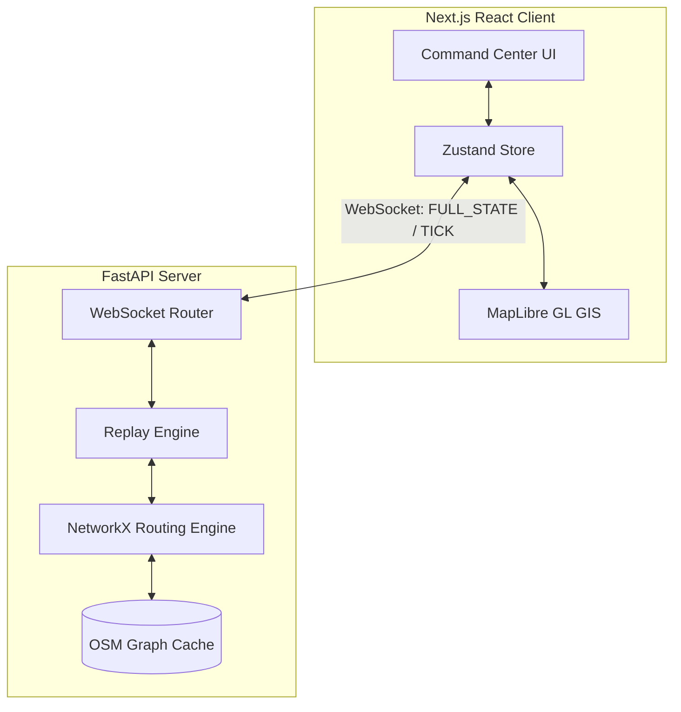

# System Overview

Deluge V2 is a production-ready GIS-powered Emergency Routing and Decision Support Platform. It operates as a Live Digital Twin, ingesting environmental states and providing dynamic, risk-aware routing for emergency responders. 

## High-Level Architecture

The platform follows a decoupled client-server architecture with real-time data synchronization.

## Core Components

1. **Frontend**: Built with Next.js and React. It uses a 3-panel layout for Mission Planning, Live GIS rendering, and Operational Intelligence. State management is handled entirely by Zustand, which binds directly to the backend WebSocket.
2. **Backend**: Built with FastAPI. It handles the core simulation tick loop (the "Replay Engine"), maintaining the state of all entities (vehicles, flood cells, infrastructure) and broadcasting updates at 10Hz.
3. **GIS Engine**: The frontend utilizes MapLibre GL for rendering complex GeoJSON structures, including 3D buildings, dynamic flood polygons, and real-time vehicle positions.
4. **Routing Engine**: The backend leverages NetworkX to perform A* pathfinding on OpenStreetMap graphs, dynamically adjusting edge weights based on real-time flood intersections.
